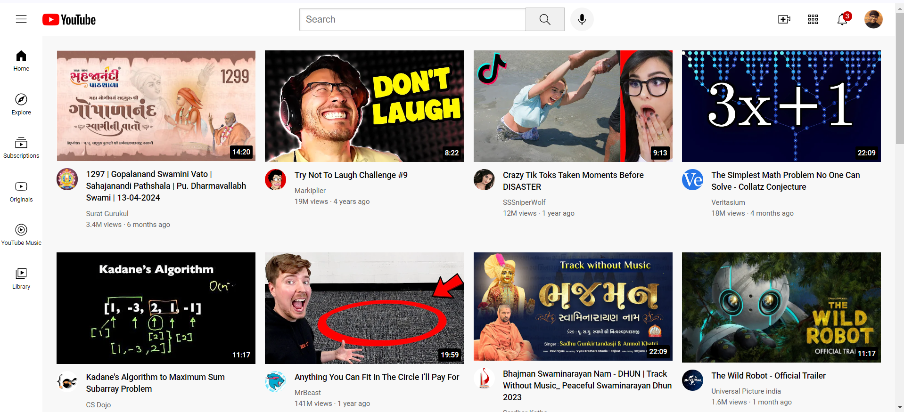

# YouTube Clone

Welcome to My YouTube Clone project! This is a responsive web application aiming to mimic the functionalities of YouTube.

## Features

- **Responsive Design:** The application is designed to work seamlessly across various devices and screen sizes.

## Technologies Used

- **Frontend:** HTML, CSS.

## Setup Instructions

1. **Clone the Repository:** `git clone https://github.com/yourusername/your-youtube-clone.git`

## Contributing

Contributions are welcome! If you'd like to contribute to this project, please fork the repository and submit a pull request with your changes. Make sure to follow the existing code style and guidelines.

## License

This project is licensed under the [MIT License](LICENSE).

## Contact

For any questions or inquiries, feel free to contact Prit Sakhvala at sakhvalaps@gmail.com.
